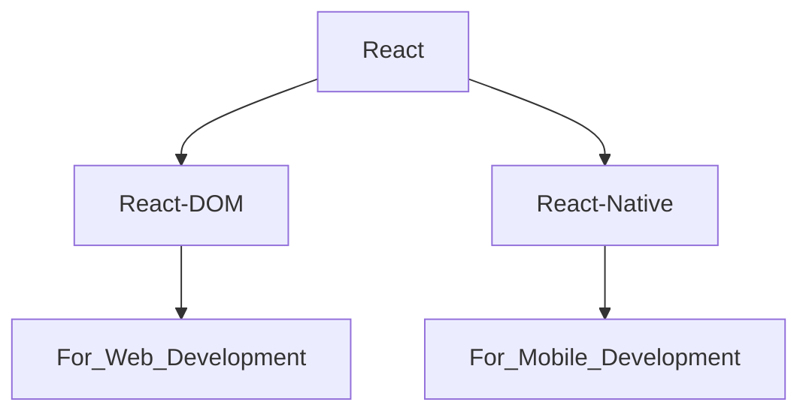

# React JS Notes

## React Library 

- React is JavaScript Library.
- React is used to Single Page Application (Complete Website in Single Page).
- In React library there are two attachments.



## Why React is Fast ??

**React use Virtual DOM.**

Example :-
``` html
<ul>
  <li>Coffee</li>
  <li>Milk</li>
  <li>Tea</li>
</ul
```
- Virtual DOM update only required list.
- Real DOM update complete list.

## How to Create project in React ??

- **npm** --> `Node Pakage Manager` (Allow us to install some libraries).
- **npx** --> `Node Pakage Executer`

**There are two ways to create project in React.**

**(i) 1st Way to create project in React.**

--> It is Time Taking Proccess.

- CMD to Create Project --> **`npx create-react-app Name_of_Project`**  
  
  - Project is created.
  - React Pacakge is installed  
    
- CMD to Run Project --> **`npm run start`**  
  
- CMD for Bulid --> **`npm run build`**  
  
  - A new build folder is created.
  - In bulid folder ReactJS code converted into JS code.
  - In production (client) bulid folder is served.
 
**(ii) 2nd Way to create project in React.**

--> By Vite (Bundller).  
--> It is faster than normal installation.

- CMD to Create Project --> **`npm create vite@latest`**
  
  - `Project Name` : Name_of_Project
  - `Select framework` : react
  - `Select Variant` : JavaScript
  - Enter and Project is created.
 
- CMD to Run Project --> **`npm run dev`**

## File Structure in React JS

**(1) `node modules`** --> It has all the installed node packages.  

**(2) `public`** -->  It contains static files that don't change. 

**(3) `src`** --> Main folder for the React code.  
- **`components`** --> Reusable parts of the UI, like buttons or headers.  
- **`assets`** --> Images, fonts, and other static files.  
- **`styles`** --> CSS or stylesheets.

**(4) `package.json`** It contains information about this project like `name, version, dependencies` on other react packages.  

**(5) `vite.config.js`** It contains vite config. 


## Components in React JS 

- Components help us write reusable, modular and better organized code.
- React application is a tree of components with App Component as the root bringing everything together.

### Types of Components 

**(i) `Class Components`**

- Stateful: Can manage state.  
- Lifecycle: Access to lifecycle methods.  
- Verbose: More boilerplate code.  
- Not Preferred anymore.

**(i) `Functional Components`**

- Initially stateless.  
- Can use Hooks for state and effects.  
- Simpler and more concise.  
- More Popular.

``` App.jsx
function App() {
  return(
      <h2>Hello Abhishek</h2>
  )
}

export default App
```

## What is JSX ??

**(1.) `Definition`** : JSX determines how the UI will look wherever the component is used.  

**(2.) `Not HTML`** : Though it resembles HTML, you're actually writing JSX, which stands for JavaScript XML.  

**(3.) `Conversion`** : JSX gets converted to regular JavaScript.  

**(4.) `Babeljs.io/repl`** : It is a tool that allows you to see how JSX is transforme. 

## Exporting Components 

- Enables the use of a component in other parts.  
- Default Export: Allows exporting a single component as the default from a module.  
- Named Export: Allows exporting multiple items from a module.  
- Importing: To use an exported component, you need to import it in the destination file using import syntax.
  
   

 ## Dynamic Components

 - Dynamic Content: JSX allows the creation of dynamic and interactive UI components.
 - JavaScript Expressions: Using {}, we can embed any JS expression directly within JSX. This includes variables, function calls, and more.

``` App.jsx
function App() {
	let name = "Abhishek Yadav";

	return (
		<>
			<h3>Hello this is {name}</h3>
		</>
	);
}

export default App;
```

## ReUsable Components

Components are modular,allowing for easy reuse across different parts of an application.  

> **App.jsx**
``` App.jsx
import Abhi from "./Components/abhi";
import Random from "./Random";

function App() {
	return (
		<>
			<h1>This is Reusable Component</h1>

			<Random></Random>                // We can use this component multiple times.
			<Random />
		</>
	);
}

export default App;
```

> **Component.jsx**
``` Component.jsx
function Random() {
	let number = Math.random() * 100;

	return (
		<>
			<h2> Random Number is : {Math.round(number)} </h2>
		</>
	);
}

export default Random;
```

## Including BootStrap in React JS

- **`Install`** --> npm i bootstrap@5.3.2

- **`Import`** --> import "bootstrap/dist/css/bootstrap.min.css";


