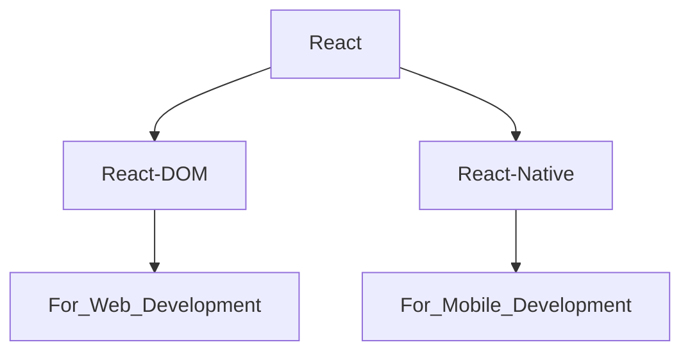

# React JS Notes

## React Library 

- In React library there are two attachments.

## How to Create project in React ??

- **npm** --> `Node Pakage Manager` (Allow us to install some libraries).
- **npx** --> `Node Pakage Executer`

**There are two ways to create project in React.**

**(i) 1st Way to create project in React.**

- CMD --> **`npx create-react-app NameofProject`**
- It is Time Taking.
