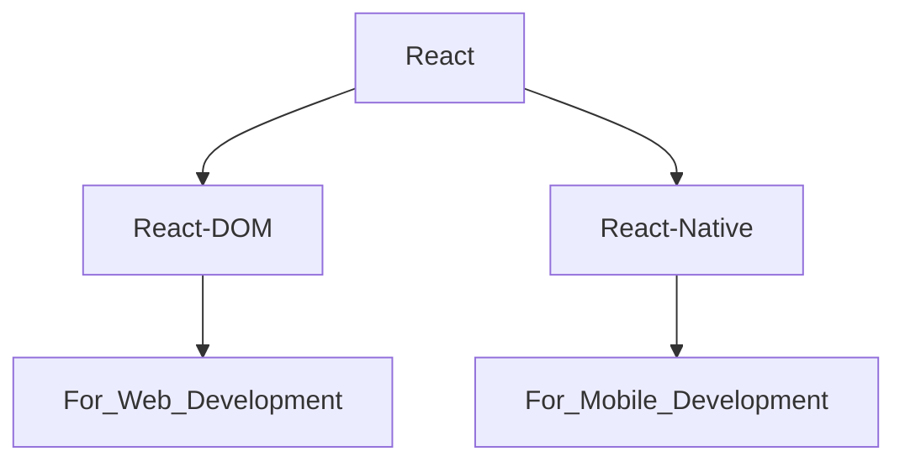

# React JS Notes

## React Library 

- React is JavaScript Library.
- React is used to Single Page Application (Complete Website in Single Page).
- In React library there are two attachments.



## Why React is Fast ??

**React use Virtual DOM.**

Example :-
``` html
<ul>
  <li>Coffee</li>
  <li>Milk</li>
  <li>Tea</li>
</ul
```
- Virtual DOM update only required list.
- Real DOM update complete list.

## How to Create project in React ??

- **npm** --> `Node Pakage Manager` (Allow us to install some libraries).
- **npx** --> `Node Pakage Executer`

**There are two ways to create project in React.**

**(i) 1st Way to create project in React.**

--> It is Time Taking Proccess.

- CMD to Create Project --> **`npx create-react-app Name_of_Project`**  
  
  - Project is created.
  - React Pacakge is installed  
    
- CMD to Run Project --> **`npm run start`**  
  
- CMD for Bulid --> **`npm run build`**  
  
  - A new build folder is created.
  - In bulid folder ReactJS code converted into JS code.
  - In production (client) bulid folder is served.
 
**(ii) 2nd Way to create project in React.**

--> By Vite (Bundller).  
--> It is faster than normal installation.

- CMD to Create Project --> **`npm create vite@latest`**
  
  - `Project Name` : Name_of_Project
  - `Select framework` : react
  - `Select Variant` : JavaScript
  - Enter and Project is created.
 
- CMD to Run Project --> **`npm run dev`**
 
  
 


